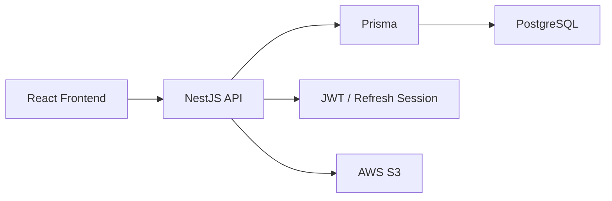

# 🛒 Shopping Backend

쇼핑몰의 회원 인증, 상품 옵션, 주문, 재고, 취소·반품, 관리자 운영 흐름을 담당하는 NestJS Backend 프로젝트입니다.

Frontend가 선택한 상품 정보를 그대로 신뢰하지 않고, Backend가 실제 옵션 조합과 현재 재고를 다시 확인한 뒤 주문 가능 여부를 결정하도록 구성했습니다.

회원뿐 아니라 비회원 주문도 지원하며, 주문 생성 이후 입금 확인·배송·취소·반품·환불까지 하나의 상태 흐름으로 연결했습니다.

## Architecture



## 주문 흐름


## 핵심 도메인 정책

### 옵션 조합과 재고는 서버가 최종 판단

Frontend는 `optionValues`만 전달합니다.

Backend는 해당 값을 기준으로 실제 option과 variant를 다시 찾고 재고를 확인합니다.

```text
productId
→ optionValues 확인
→ variant 조회
→ 재고 검증
→ 재고 차감
→ 주문 생성
```

존재하지 않는 옵션 조합이나 재고 부족 상태에서는 주문을 생성하지 않습니다.

### 주문 상태에 따라 재고 복구 시점을 분리

- 주문 생성 → 재고 차감
- 미입금 주문 취소 → 재고 복구
- 반품 요청 → 재고 유지
- 반품 승인 → 재고 유지
- 환불 완료 → 재고 복구

취소·환불 요청이 동시에 처리돼도 상태 전이를 선점한 작업만 재고를 복구하도록 구성해 중복 복구를 방지합니다.

### 회원·비회원 주문 접근 기준을 분리

회원 주문은 인증된 사용자 ID를 기준으로 소유권을 확인합니다.

비회원 주문은 계정이 없기 때문에 **주문번호와 주문 당시 휴대폰 번호를 함께 검증**해 주문 조회·취소·반품을 허용합니다.

### 인증 흐름

```text
Access Token
→ Frontend memory

Refresh Token
→ HttpOnly Cookie

Refresh Session
→ Database에는 token hash 저장
```

일반 API의 401에서는 자동 refresh/retry를 반복하지 않고, 앱 최초 진입 등 필요한 시점에서만 refresh를 시도하도록 Frontend와 역할을 나눴습니다.

---

## 주요 기능

### Auth
- 회원가입 / 로그인 / 로그아웃
- Access Token 발급
- HttpOnly Refresh Token Cookie
- Refresh Session
- 비밀번호 변경 / 재설정

### Catalog
- 상품 / 카테고리 조회
- 상품 옵션 관리
- Variant 및 재고 검증
- 상품 이미지

### Order
- 회원 / 비회원 주문
- 주문 조회
- 입금 확인
- 배송 처리
- 미입금 취소
- 배송 완료

### Return
- 반품 요청
- 관리자 승인 / 거절
- 환불 처리
- 환불 완료 시 재고 복구

### Admin
- 상품 등록 / 수정 / 삭제
- 주문 관리
- 반품 관리
- 공지 / FAQ 관리

## Tech Stack

| 구분 | 기술 |
| --- | --- |
| Framework | NestJS |
| Language | TypeScript |
| Database | PostgreSQL |
| ORM | Prisma |
| Auth | JWT, Passport |
| Validation | class-validator |
| Password | bcryptjs |
| Storage | AWS S3 |
| Test | Jest |

## 프로젝트 구조

```text
src
├─ features
│  ├─ admin
│  ├─ auth
│  ├─ catalog
│  ├─ notices
│  ├─ orders
│  ├─ qna
│  ├─ returns
│  ├─ system
│  └─ users
├─ prisma
└─ shared
```

## 환경 변수

```env
DATABASE_URL=

PORT=8080
CORS_ORIGIN=http://localhost:3000

JWT_ACCESS_SECRET=
JWT_REFRESH_SECRET=
JWT_PASSWORD_RESET_SECRET=

ACCESS_EXPIRES_IN=15m
REFRESH_EXPIRES_IN=14d
PW_RESET_EXPIRES_IN=1h

COOKIE_SECURE=false
COOKIE_SAMESITE=lax

AWS_REGION=
AWS_S3_BUCKET=
AWS_ACCESS_KEY_ID=
AWS_SECRET_ACCESS_KEY=
```

실제 secret 값은 Git에 포함하지 않습니다.

## 실행

```bash
npm install
npx prisma generate
npm run start:dev
```

Migration:

```bash
npx prisma migrate dev
```

Build:

```bash
npm run build
```

Test:

```bash
npm test
```

## 검증 범위

현재 코드 정리 기준:

- Backend unit test 통과
- Backend build 통과
- 주문번호를 안전한 랜덤 식별자 방식으로 변경
- 인증 관련 민감정보 logging 제거
- 취소·환불 동시 처리 시 재고 중복 복구 방지

실제 PostgreSQL에 동시 요청을 발생시키는 concurrency E2E는 별도로 수행하지 않았습니다.

## Related

- Frontend: `shopping-frontend`
- 상세 설계 및 Troubleshooting: [Notion](https://app.notion.com/p/2d425931ce3580c98950e512d209cb54)